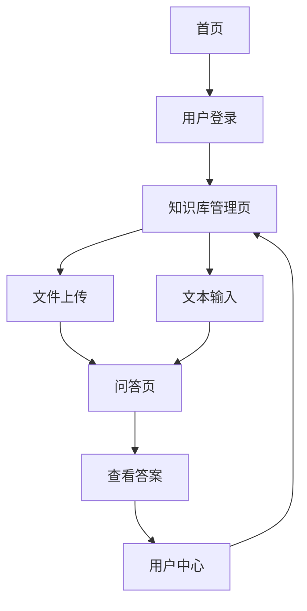

# RAG系统产品需求文档

## 1. 产品概述

本产品是一个基于检索增强生成(RAG)技术的智能问答系统，用户可以上传文档或输入文本作为知识库，系统将基于这些内容提供准确的问答服务。
- 解决用户需要基于特定文档进行智能问答的需求，适用于企业知识管理、学习辅助等场景。
- 目标是为用户提供一个简单易用的个人或团队知识库问答平台。

## 2. 核心功能

### 2.1 用户角色

| 角色 | 注册方式 | 核心权限 |
|------|----------|----------|
| 普通用户 | 邮箱注册 | 可上传文档、输入文本、进行问答查询 |

### 2.2 功能模块

我们的RAG系统包含以下主要页面：
1. **首页**: 导航栏、功能介绍、快速开始按钮
2. **知识库管理页**: 文件上传区域、文本输入区域、已上传内容列表
3. **问答页**: 问题输入框、答案显示区域、历史对话记录
4. **用户中心**: 用户信息、使用统计、设置选项

### 2.3 页面详情

| 页面名称 | 模块名称 | 功能描述 |
|----------|----------|----------|
| 首页 | 导航栏 | 显示Logo、主要功能入口、用户登录状态 |
| 首页 | 功能介绍 | 展示RAG系统核心功能和使用流程 |
| 首页 | 快速开始 | 引导用户快速体验系统功能 |
| 知识库管理页 | 文件上传区域 | 支持拖拽上传多种格式文档(PDF、TXT、DOCX)，显示上传进度 |
| 知识库管理页 | 文本输入区域 | 提供富文本编辑器，支持直接输入和编辑文本内容 |
| 知识库管理页 | 内容列表 | 显示已上传文件和文本，支持预览、编辑、删除操作 |
| 问答页 | 问题输入 | 提供问题输入框，支持语音输入和文本输入 |
| 问答页 | 答案显示 | 展示AI生成的答案，标注信息来源，支持答案评价 |
| 问答页 | 对话历史 | 保存和显示历史问答记录，支持搜索和导出 |
| 用户中心 | 个人信息 | 显示和编辑用户基本信息 |
| 用户中心 | 使用统计 | 展示上传文档数量、问答次数等统计信息 |

## 3. 核心流程

**用户操作流程：**
1. 用户注册登录系统
2. 进入知识库管理页面，通过拖拽或点击上传文档文件
3. 或者在文本输入区域直接输入文本内容
4. 系统自动处理并存储文档内容到向量数据库
5. 用户进入问答页面，输入问题
6. 系统检索相关内容并生成答案
7. 用户查看答案和来源信息，可进行评价反馈

## 4. 用户界面设计

### 4.1 设计风格

- **主色调**: 蓝色系(#3B82F6)作为主色，白色(#FFFFFF)作为背景色
- **辅助色**: 灰色系(#6B7280)用于次要信息，绿色(#10B981)用于成功状态
- **按钮样式**: 圆角按钮，主按钮使用渐变效果，次要按钮使用边框样式
- **字体**: 系统默认字体，标题使用16-24px，正文使用14-16px
- **布局风格**: 卡片式布局，顶部导航栏，左侧边栏可选
- **图标风格**: 使用简洁的线性图标，支持上传、问答、设置等功能图标

### 4.2 页面设计概览

| 页面名称 | 模块名称 | UI元素 |
|----------|----------|--------|
| 首页 | 导航栏 | 蓝色背景，白色Logo和文字，右侧登录按钮 |
| 首页 | 功能介绍 | 三栏卡片布局，每个卡片包含图标、标题和描述 |
| 知识库管理页 | 文件上传区域 | 虚线边框的拖拽区域，中央显示上传图标和提示文字 |
| 知识库管理页 | 文本输入区域 | 白色背景的富文本编辑器，工具栏包含格式化选项 |
| 问答页 | 问题输入 | 底部固定的输入框，圆角设计，右侧发送按钮 |
| 问答页 | 答案显示 | 对话气泡样式，用户问题右对齐，AI答案左对齐 |

### 4.3 响应式设计

系统采用移动端优先的响应式设计，在桌面端提供更丰富的功能布局，移动端优化触摸交互体验，确保在各种设备上都能良好使用。