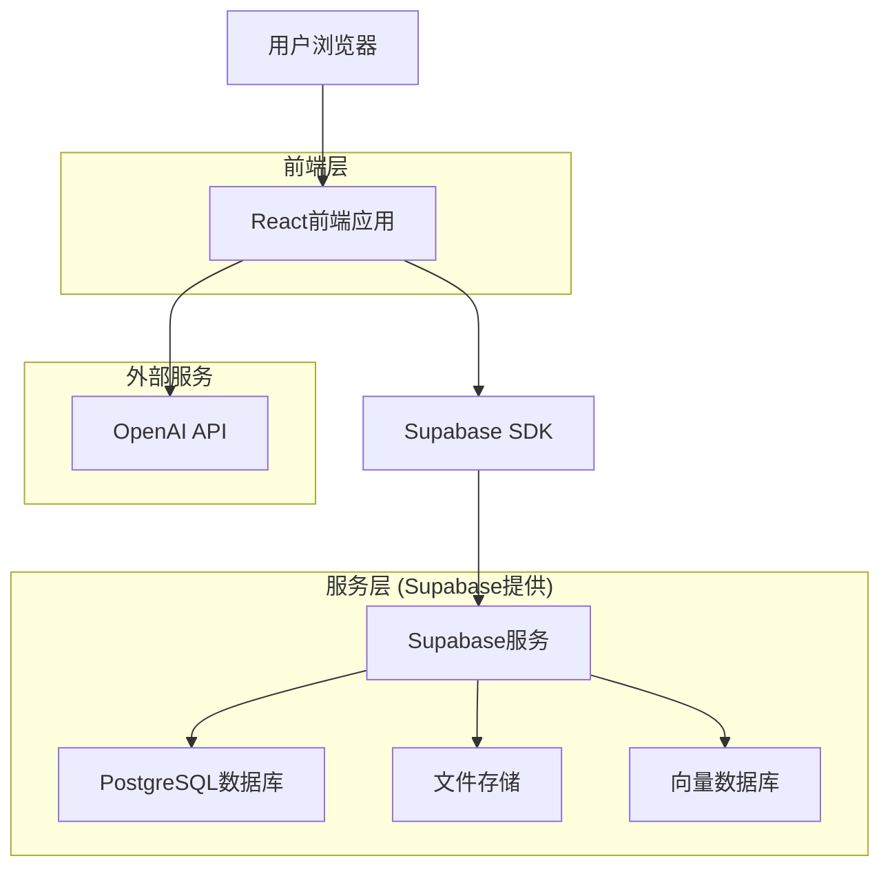
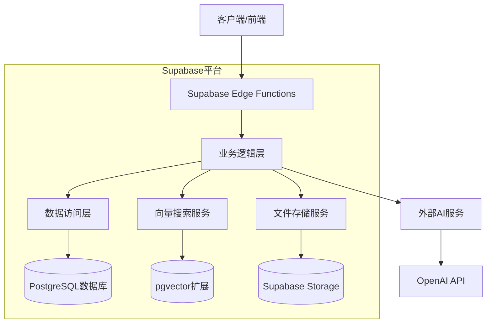
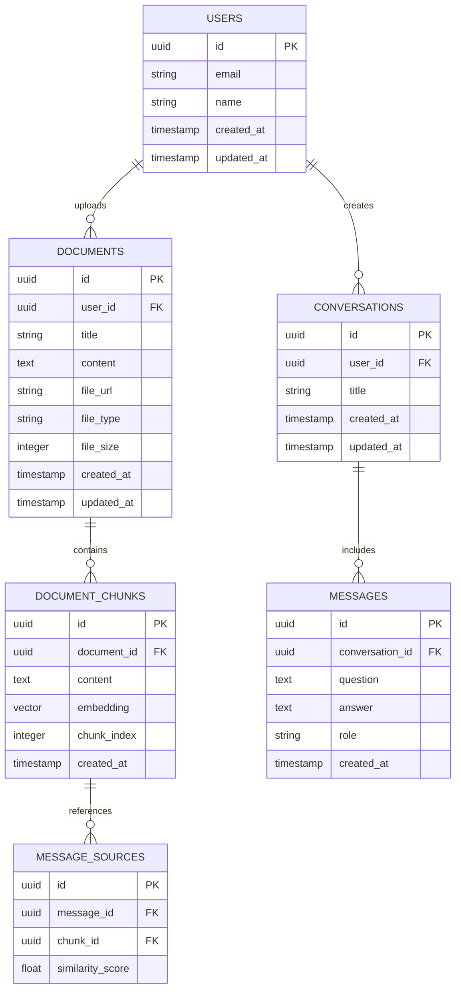

# RAG系统技术架构文档

## 1. 架构设计



## 2. 技术描述

- **前端**: React@18 + TypeScript + Tailwind CSS@3 + Vite
- **后端**: Supabase (PostgreSQL + 实时订阅 + 文件存储 + 向量搜索)
- **AI服务**: OpenAI API (文本嵌入和生成)
- **状态管理**: React Context + useState/useEffect
- **文件处理**: react-dropzone + pdf-parse

## 3. 路由定义

| 路由 | 用途 |
|------|------|
| / | 首页，展示系统介绍和快速开始 |
| /login | 登录页面，用户身份验证 |
| /register | 注册页面，新用户注册 |
| /knowledge | 知识库管理页面，文件上传和文本输入 |
| /chat | 问答页面，AI对话界面 |
| /profile | 用户中心，个人信息和使用统计 |

## 4. API定义

### 4.1 核心API

**用户认证相关**
```
POST /auth/v1/signup
```

请求:
| 参数名 | 参数类型 | 是否必需 | 描述 |
|--------|----------|----------|------|
| email | string | true | 用户邮箱 |
| password | string | true | 用户密码 |
| name | string | true | 用户姓名 |

响应:
| 参数名 | 参数类型 | 描述 |
|--------|----------|------|
| user | object | 用户信息对象 |
| session | object | 会话信息 |

**文档管理相关**
```
POST /rest/v1/documents
```

请求:
| 参数名 | 参数类型 | 是否必需 | 描述 |
|--------|----------|----------|------|
| title | string | true | 文档标题 |
| content | string | true | 文档内容 |
| file_url | string | false | 文件存储URL |
| user_id | uuid | true | 用户ID |

响应:
| 参数名 | 参数类型 | 描述 |
|--------|----------|------|
| id | uuid | 文档ID |
| created_at | timestamp | 创建时间 |

**问答相关**
```
POST /rest/v1/conversations
```

请求:
| 参数名 | 参数类型 | 是否必需 | 描述 |
|--------|----------|----------|------|
| question | string | true | 用户问题 |
| user_id | uuid | true | 用户ID |

响应:
| 参数名 | 参数类型 | 描述 |
|--------|----------|------|
| answer | string | AI生成的答案 |
| sources | array | 相关文档来源 |
| conversation_id | uuid | 对话ID |

## 5. 服务器架构图



## 6. 数据模型

### 6.1 数据模型定义



### 6.2 数据定义语言

**用户表 (users)**
```sql
-- 用户表由Supabase Auth自动创建和管理
-- 扩展用户配置表
CREATE TABLE user_profiles (
    id UUID PRIMARY KEY REFERENCES auth.users(id) ON DELETE CASCADE,
    name VARCHAR(100) NOT NULL,
    avatar_url TEXT,
    created_at TIMESTAMP WITH TIME ZONE DEFAULT NOW(),
    updated_at TIMESTAMP WITH TIME ZONE DEFAULT NOW()
);

-- 启用RLS
ALTER TABLE user_profiles ENABLE ROW LEVEL SECURITY;

-- 创建策略
CREATE POLICY "用户只能查看自己的配置" ON user_profiles
    FOR SELECT USING (auth.uid() = id);

CREATE POLICY "用户只能更新自己的配置" ON user_profiles
    FOR UPDATE USING (auth.uid() = id);
```

**文档表 (documents)**
```sql
CREATE TABLE documents (
    id UUID PRIMARY KEY DEFAULT gen_random_uuid(),
    user_id UUID NOT NULL REFERENCES auth.users(id) ON DELETE CASCADE,
    title VARCHAR(255) NOT NULL,
    content TEXT,
    file_url TEXT,
    file_type VARCHAR(50),
    file_size INTEGER,
    created_at TIMESTAMP WITH TIME ZONE DEFAULT NOW(),
    updated_at TIMESTAMP WITH TIME ZONE DEFAULT NOW()
);

-- 创建索引
CREATE INDEX idx_documents_user_id ON documents(user_id);
CREATE INDEX idx_documents_created_at ON documents(created_at DESC);

-- 启用RLS
ALTER TABLE documents ENABLE ROW LEVEL SECURITY;

-- 创建策略
CREATE POLICY "用户只能访问自己的文档" ON documents
    FOR ALL USING (auth.uid() = user_id);
```

**文档块表 (document_chunks)**
```sql
-- 启用pgvector扩展
CREATE EXTENSION IF NOT EXISTS vector;

CREATE TABLE document_chunks (
    id UUID PRIMARY KEY DEFAULT gen_random_uuid(),
    document_id UUID NOT NULL REFERENCES documents(id) ON DELETE CASCADE,
    content TEXT NOT NULL,
    embedding vector(1536), -- OpenAI embedding维度
    chunk_index INTEGER NOT NULL,
    created_at TIMESTAMP WITH TIME ZONE DEFAULT NOW()
);

-- 创建向量索引
CREATE INDEX idx_document_chunks_embedding ON document_chunks 
    USING ivfflat (embedding vector_cosine_ops) WITH (lists = 100);

CREATE INDEX idx_document_chunks_document_id ON document_chunks(document_id);

-- 启用RLS
ALTER TABLE document_chunks ENABLE ROW LEVEL SECURITY;

-- 创建策略
CREATE POLICY "用户只能访问自己文档的块" ON document_chunks
    FOR ALL USING (
        EXISTS (
            SELECT 1 FROM documents 
            WHERE documents.id = document_chunks.document_id 
            AND documents.user_id = auth.uid()
        )
    );
```

**对话表 (conversations)**
```sql
CREATE TABLE conversations (
    id UUID PRIMARY KEY DEFAULT gen_random_uuid(),
    user_id UUID NOT NULL REFERENCES auth.users(id) ON DELETE CASCADE,
    title VARCHAR(255) NOT NULL DEFAULT '新对话',
    created_at TIMESTAMP WITH TIME ZONE DEFAULT NOW(),
    updated_at TIMESTAMP WITH TIME ZONE DEFAULT NOW()
);

-- 创建索引
CREATE INDEX idx_conversations_user_id ON conversations(user_id);
CREATE INDEX idx_conversations_updated_at ON conversations(updated_at DESC);

-- 启用RLS
ALTER TABLE conversations ENABLE ROW LEVEL SECURITY;

-- 创建策略
CREATE POLICY "用户只能访问自己的对话" ON conversations
    FOR ALL USING (auth.uid() = user_id);
```

**消息表 (messages)**
```sql
CREATE TABLE messages (
    id UUID PRIMARY KEY DEFAULT gen_random_uuid(),
    conversation_id UUID NOT NULL REFERENCES conversations(id) ON DELETE CASCADE,
    question TEXT NOT NULL,
    answer TEXT NOT NULL,
    role VARCHAR(20) NOT NULL CHECK (role IN ('user', 'assistant')),
    created_at TIMESTAMP WITH TIME ZONE DEFAULT NOW()
);

-- 创建索引
CREATE INDEX idx_messages_conversation_id ON messages(conversation_id);
CREATE INDEX idx_messages_created_at ON messages(created_at DESC);

-- 启用RLS
ALTER TABLE messages ENABLE ROW LEVEL SECURITY;

-- 创建策略
CREATE POLICY "用户只能访问自己对话的消息" ON messages
    FOR ALL USING (
        EXISTS (
            SELECT 1 FROM conversations 
            WHERE conversations.id = messages.conversation_id 
            AND conversations.user_id = auth.uid()
        )
    );
```

**消息来源表 (message_sources)**
```sql
CREATE TABLE message_sources (
    id UUID PRIMARY KEY DEFAULT gen_random_uuid(),
    message_id UUID NOT NULL REFERENCES messages(id) ON DELETE CASCADE,
    chunk_id UUID NOT NULL REFERENCES document_chunks(id) ON DELETE CASCADE,
    similarity_score FLOAT NOT NULL
);

-- 创建索引
CREATE INDEX idx_message_sources_message_id ON message_sources(message_id);
CREATE INDEX idx_message_sources_similarity_score ON message_sources(similarity_score DESC);

-- 启用RLS
ALTER TABLE message_sources ENABLE ROW LEVEL SECURITY;

-- 创建策略
CREATE POLICY "用户只能访问自己消息的来源" ON message_sources
    FOR ALL USING (
        EXISTS (
            SELECT 1 FROM messages 
            JOIN conversations ON conversations.id = messages.conversation_id
            WHERE messages.id = message_sources.message_id 
            AND conversations.user_id = auth.uid()
        )
    );
```

**权限设置**
```sql
-- 为anon角色授予基本权限
GRANT SELECT ON user_profiles TO anon;
GRANT SELECT ON documents TO anon;
GRANT SELECT ON document_chunks TO anon;
GRANT SELECT ON conversations TO anon;
GRANT SELECT ON messages TO anon;
GRANT SELECT ON message_sources TO anon;

-- 为authenticated角色授予完整权限
GRANT ALL PRIVILEGES ON user_profiles TO authenticated;
GRANT ALL PRIVILEGES ON documents TO authenticated;
GRANT ALL PRIVILEGES ON document_chunks TO authenticated;
GRANT ALL PRIVILEGES ON conversations TO authenticated;
GRANT ALL PRIVILEGES ON messages TO authenticated;
GRANT ALL PRIVILEGES ON message_sources TO authenticated;
```